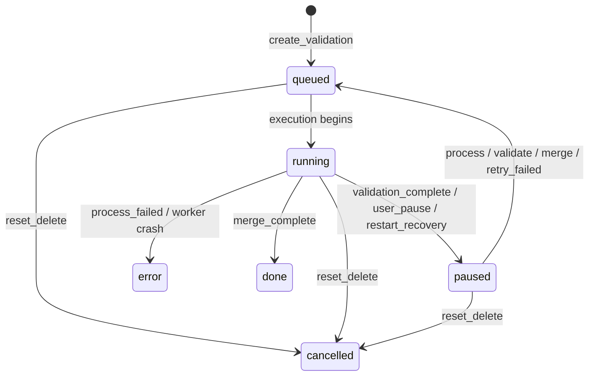

# 状态机：公开快照与内部状态

本文区分三层概念：

- 内部 durable workflow：`JobStatus.state` + `JobStatus.phase`
- 进程内 volatile execution：`ExecutionRegistry`
- 前端公开快照：`workflow_phase`、`execution_state`、`wait_reason`、`terminal_state`、`available_commands`

前端不直接消费内部 `state`，也不从 `paused` 猜“现在该显示什么按钮”。

## 公开快照

| 字段 | 含义 |
| --- | --- |
| `workflow_phase` | `validate | process | merge | done` |
| `execution_state` | `idle | queued | running`；来自 volatile execution registry |
| `wait_reason` | 仅当 durable workflow 处于可恢复 idle 状态时非空 |
| `terminal_state` | `done | error | cancelled | null` |
| `available_commands` | 当前允许 UI 触发的显式命令列表 |

## 内部 durable workflow

### `phase`

- `validate`：校验/预处理阶段
- `process`：LLM 处理阶段
- `merge`：等待或执行合并
- `done`：任务完成

### `state`

- `queued`：某个命令已经进入执行路径
- `running`：某个命令正在运行
- `paused`：当前没有 active execution，但任务可继续
- `error`：任务失败，需要显式修复后继续
- `done`：最终输出已生成
- `cancelled`：任务被 reset/delete

### `wait_reason`

仅允许出现在 `state=paused`：

- `ready_to_process`
- `user_paused`
- `ready_to_merge`
- `server_recovered`

除此之外，`wait_reason` 必须为空。

## chunk 状态

| 状态 | 含义 |
| --- | --- |
| `pending` | 待处理 |
| `processing` | 正在处理 |
| `retrying` | 同一次 chunk 处理内部的自动重试/退避 |
| `done` | 成功 |
| `error` | 失败 |

`retrying` 不是“手动待重试队列”；手动 `retry-failed` 会把 failed chunks 重置成 `pending` 再重新调度。

## 命令决策

`novel_proofer.workflow` 是唯一 command decision 来源。

### 允许条件

| 命令 | 条件 |
| --- | --- |
| `validate` | `state=paused` 且 `phase=validate` |
| `process` | `state=paused` 且 `phase=process` |
| `pause` | `phase=process` 且内部 state 为 `queued/running` |
| `retry-failed` | `state=error` 且至少一个 chunk 为 `error` |
| `merge` | `state=paused` 且 `phase=merge` 且所有 chunks 为 `done` |
| `detach` | 非 active execution |
| `reset` | 任何非 `cancelled` 任务 |
| `download` | `state=done` |

### merge 拒绝语义

`merge` 失败时不再混用模糊错误：

- failed chunks：`FAILED_CHUNKS`，消息为 `job is not ready to merge (chunks failed)`
- incomplete chunks：`CHUNKS_INCOMPLETE`，消息为 `job is not ready to merge (chunks incomplete)`

这两个 rejection 会同时影响 API `409`、runner event 校验、以及测试断言。

## 事件转移

更精确地说：

- `validation_complete` -> `paused + process + ready_to_process`
- `process_complete` -> `paused + merge + ready_to_merge`
- `process_failed` -> `error + process`
- `restart_recovery` -> `paused + same_phase + server_recovered`

## execution registry

`ExecutionRegistry` 只保存当前进程内的：

- `job_id`
- `attempt_id`
- `command`
- `state=queued|running`
- `stop_requested=pause|delete|null`

它不持久化。进程重启后：

- registry 为空
- API `execution_state` 会变成 `idle`
- durable workflow 通过 `server_recovered` 诚实表达“任务可继续，但没有 worker 还活着”

## 前端约束

前端只做这几件事：

- 渲染公开快照
- 按 `available_commands` 控制按钮
- 本地保存 `UiAttachment`
- 刷新/关闭页面时停止 observer

前端不允许：

- 根据 `paused` 自己推断 `ready_to_process` / `ready_to_merge`
- 在 `pagehide` / `beforeunload` 里调用 pause/reset
- 从旧调试目录或旧兼容字段推导 lifecycle
