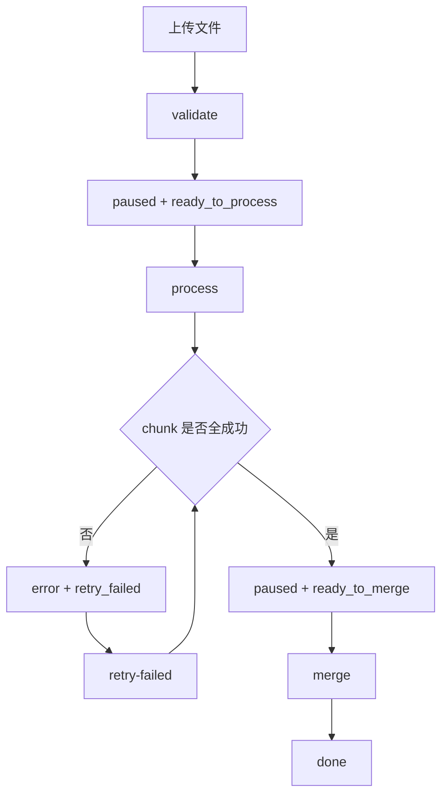
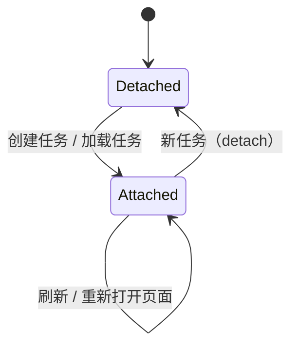

# Workflow：任务生命周期与页面关联

本文只描述最终工作流，不保留旧的浏览器生命周期兼容语义。

## 核心模型

- `JobRecord`：后端持久化任务。它保存 workflow、chunk 汇总、输入/输出路径、格式快照、最近一次 LLM 信息，以及调试/诊断数据。
- `JobExecution`：当前进程内的执行尝试。它只表示“现在有没有 worker 在跑、正在跑什么命令、是否收到了 pause/delete stop 请求”。
- `UiAttachment`：浏览器当前页面关联到哪个 `job_id`。它只影响 UI 观察对象，不改变后端任务生命周期。

结论很简单：

- 刷新页面：不会暂停、删除、取消、abort 后端任务。
- 关闭页面：不会暂停、删除、取消、abort 后端任务。
- 重新打开页面：只会重新关联 `UiAttachment` 并读取最新快照。
- 真正改变任务生命周期的只有显式命令。

## 主流程

### 阶段含义

- `validate`：读取输入缓存，分片，执行确定性预处理规则，生成可继续的任务快照。
- `process`：执行 LLM 校对。失败分片会进入 `error`，用户可修改 LLM 配置后执行 `retry-failed`。
- `merge`：所有分片成功后，用户显式点击合并，生成最终输出文件。
- `done`：最终输出已生成，可下载或删除任务记录。

## 页面行为

- `Detached`：页面没有关联任何任务。
- `Attached`：页面正在轮询某个任务快照。
- “新任务”只解除当前页面关联，不删除旧任务。
- “加载任务”把页面重新关联到某个持久化任务。

`UiAttachment` 是浏览器本地状态，不是后端锁，也不是任务所有权。

## 显式命令

| 命令 | 前提 | 结果 |
| --- | --- | --- |
| `validate` | 新任务或 `phase=validate` 且可恢复 | 开始/继续预处理 |
| `process` | `wait_reason=ready_to_process` / `user_paused` / `server_recovered` | 开始/继续 LLM 处理 |
| `pause` | 当前存在进行中的 process execution | 发出 stop 请求，并把 durable workflow 收敛为 `paused + user_paused` |
| `retry-failed` | `terminal_state=error` 且存在 failed chunks | 仅重跑 failed chunks |
| `merge` | `phase=merge` 且所有 chunks 都是 `done` | 开始合并输出 |
| `detach` | 任务当前不在 active execution 中 | 页面解除关联 |
| `reset` | 任何非 `cancelled` 任务 | 删除任务记录和中间产物，不删最终输出 |
| `download` | `terminal_state=done` | 下载最终输出 |

UI 只根据 `available_commands` 决定按钮是否可用，不再从内部 `state=paused` 猜业务语义。

## 恢复语义

### 服务重启

- `JobExecution` 不持久化，重启后为空。
- 持久化的 `JobRecord` 会把旧的 in-flight workflow 收敛为 `paused + server_recovered`。
- 处于 `processing/retrying` 的 chunk 会收敛为 `pending`。
- 继续处理或重试失败分片时，runner 会从输入缓存重建目标分片的预处理文本，不依赖旧的 `pre/*.txt` 小文件。

### 输入缓存

输入缓存 `output/.inputs/{job_id}.txt` 是这些行为的 durable truth：

- `rerun-all`
- 重启后 `resume`
- 重启后 `retry-failed`
- `/input-stats`

如果输入缓存缺失，这些能力应该明确失败，而不是偷偷退回调试目录做兼容猜测。

## 调试目录

`output/.jobs/{job_id}/` 仍然是调试目录，但它不是 workflow truth：

- `out/`：分片最终输出
- `resp/`：可选 raw 响应
- `pre/`：保留目录结构，用于调试布局与少量测试断言；不是恢复来源
- `README.txt`：目录说明

删除调试目录不会改变任务的 durable workflow；删除输入缓存才会让恢复能力失效。
